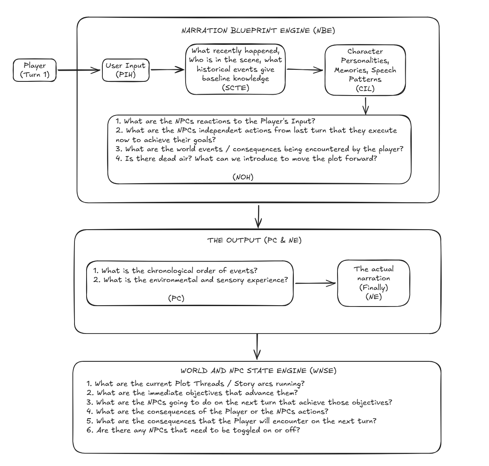

# IMMERSIVE LIVING WORLD RULESET [ILWR]
## **Where does it Run?**
This is a collection of interconnected GM Guides designed to facilitate roleplay in the AIRealm Platform (https://airealm.com/)

## **What is the ILWR?**
The Immersive Living World QOL Ruleset (ILWR) is a set of guides that aims to achieve the following:

1. **Faithful NPCs**: Portrays recurring characters accurately using their specific baseline personalities, speech quirks, and histories instead of defaulting to generic tropes.

2. **Deterministic World**: Simulates a responsive environment where dynamic events, consequences, and proactive background NPC actions actively collide with the player.

3. **Deep Sensory Immersion**: Weaves player inputs smoothly into the prose while focusing strictly on visceral sensations (e.g., the hairs on your neck rise vs. you feel a sense of dread).

## **Can you Vizualize it for me?**


## **Why did you make the ILWR?**
Long story short my Tsundere wife in one of my campaigns was being written as a bitch, more Tsun no Dere. Pissed me off.  As a ~~degenerate~~ man of culture i could not let that stand so here we are. 

## **Why is it written this way?**
The ILWR branches off the usual principles of AI Prompt engineering in order to leverage the following facts

1. **They are ultra-advanced auto completes not real AI**: LLMs are not creative writers, they are next token prediction engines, they take instructions, what they have written and mathematically predict the next most probable token. The ILWR takes advantage of this by having them write out their scratch pad in order to weight the next token prediction in favor of the desired outcome (the tsundere wife's affection)

2. **They have Recency Bias**: LLMs are hyper-influenced by the text patterns they just generated. ILWR forces the AI to output its own data structures and trackers right above the story text, essentially transforming the model into its own persistent state database.

3. **LLMs cannot "Think ahead"**: it cannot generate a plot thread like a novelist, it wings it every time. The ILWR forces the LLM to think ahead by mapping out its turn by turn moves based on weighted desired outcomes (WNSE)

4. **They love "efficiency"**: LLMs are lazy machines that generally take the path of least resistance / efficient solution leaning on its training data it can and will reduce things to tropes and condense where it can because that is what is easy. The ILWR tries to break this behavior by simulating  <think> block the LLM may bastardize the ILWR but it will still perform better than vanilla.

5. **Lost in the middle / Context Dilution**: AI Realm passes a massive data payload on every turn. Stuffed in the middle of a mega-prompt, some lore and nuance may get ignored or skimmed. ILWR curbs this by forcing the AI to step through an analytical blueprint (a think block, turning a non-thinking model into one), typing out verbatim references immediately before firing the prose.

## **So what would you describe it?**
I won't because I'm biased, but if you drop the ruleset into an AI analyst and ask what the hell it is, it will tell you something along these lines: 
> "An analytically driven state-machine engine designed for deterministic text simulation. It is not a creative writing prompt; it is a pseudocode programming script executed via natural language..."

## **How do I get started?**

**New Campaigns**: I suggest using the world package: `L7F-V33`

**Existing Campaigns**: Copy the guides in this repository into your game then enable the `ILWR_Boostrap` and tell the AI DM in OOC to run it and confirm understanding, afterwards you can start playing and disable the bootstrap once confirming it works

## **How do I know it's working?**
When the AI generates a response you should see a header indicating the ILWR FRAMEWORK

[ILWR FRAMEWORK: NBE (PIH ->SCTE->CIL->NOH) -> PC -> NE -> WNSE]

Followed by HTML Dropdowns for the NARRATION BLUEPRINT ENGINE [NBE], PROSE CONSTRUCTION [PC] 

Then the actual narration

Finally another HTML drop down for the WORLD AND NPC STATE ENGINE [WNSE]

## **How do I get back on track?**
Easiest way to do it is to check the dropdowns where it's seemingly failing, enable the ILWR_Bootstrap GM Guide then have the AI run it again
Then start playing and disable the `ILWR_Bootstrap` once it is satisfactory
Otherwise you can also point to the AI in OOC specific things it is failing on and it should correct it

## **What models can run it?**
I haven't tested all of them but so far I have tried:

- MiMo 2.5 Pro (Personal Favorite but it is prone to timeout)
- MiMo 2.5 (Has tropey long winded responses and is also prone to timeouts but a good free alternative)
- DeepSeek 4.1 Thinking (Starting to like this)
- Muse 1.2 (Good at first but quality dropped recently)
- DeepSeek v4 Pro (DS is an uphill battle though)
- Minimax M3 (Starting to like this)
- Gemini 3.7 Flash (3.7 Flash because of its streaming mode allows for massive token outputs)
- Other Gemini Models (But those have stricter token outputs so it will condense the ILWR to have enough for the prose)

## **Can I make my own plot threads / world events?**
Yes! the **WORLD AND NPC STATE ENGINE [WNSE]** relies on the following source of truth you can maintain: `ILWR - WNSE: OPEN PLOT THREADS & WORLD EVENTS`.
You can fill it with whatever you want then go into OOC and tell the AI that these are the plot threads / world events then have it generate a fresh WNSE based on it

To run a strict arc, structure your plot thread to reference the GM guide for your calendar / narrative arc as the long term objective, then make the milestones the actual sequential beats of your arc:

```text
[Plot Thread 3: Council Esports & Academic Split]
NPC Roster: N/A
Long Term Objective: Play through GM Guide: CAMPAIGN PHYSICS: ACADEMIC & ESPORT CALENDAR - YEAR 2020 | Win the 2020 D&D World Championships
Latest Milestone/Conflict: 3/5 Roster Locked — Monday April 6 plan set: Kyle + Mami meet at Nerima main gate 12:15, visit D&D club booth, recruit Lightbane (Life Cleric) and Fortress (Bear Barbarian), 5v5 tryout at 7 PM online
Next Milestone/Conflict: April 6–11 | Uni: Club Recruitment Week (Shinkan) | D&D: Pre-Season Team Registrations
```

:pushpin: **Important**: Set the NPC Roster to **N/A** so there is no forced random NPC generation when not needed.

The AI will see this plot thread and the next conflict, then generate the appropriate world events to trigger them.
**Voila! Actual Arc progression without player input (supposedly, your AI may be lazy, bonk it)**

# Contributing and Usage Guidelines
Feel free to fork, adapt, or draw inspiration. If you encounter issues or have suggestions, open an issue or hop into the official AI Realm Discord Server!

License: AGPL 3.0—use freely. Give credit where credit is due. Or not, I'm not your daddy.

Updates: Whenever I can, refinements and addons will be made and pushed into separate folders by date
